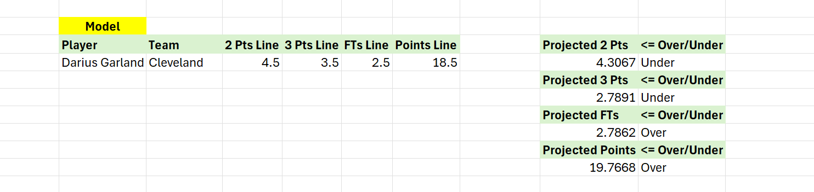

# NBA Model

**NBA Model** is an Excel-based analytics tool designed to support NBA player prop betting decisions.

## Features
- Input a player's name and betting lines.
- Get projections for Points, 3PT Made, 2PT Made, FT Made, and Over/Under recommendations.
- Built using queried datasets and custom Excel formulas.
- Includes matchup analysis to support and validate recommendations.

## Future Goals
- Automatically fetch PrizePicks player stat lines when a player’s name is entered.

## Tools Used
- Microsoft Excel
- Power Query
- Manual matchup research

## Files Included
- NBA Model.xlsx – Main tool

## Preview
- Image of model making predictions on Cleveland Cavaliers player Darius Garland.

